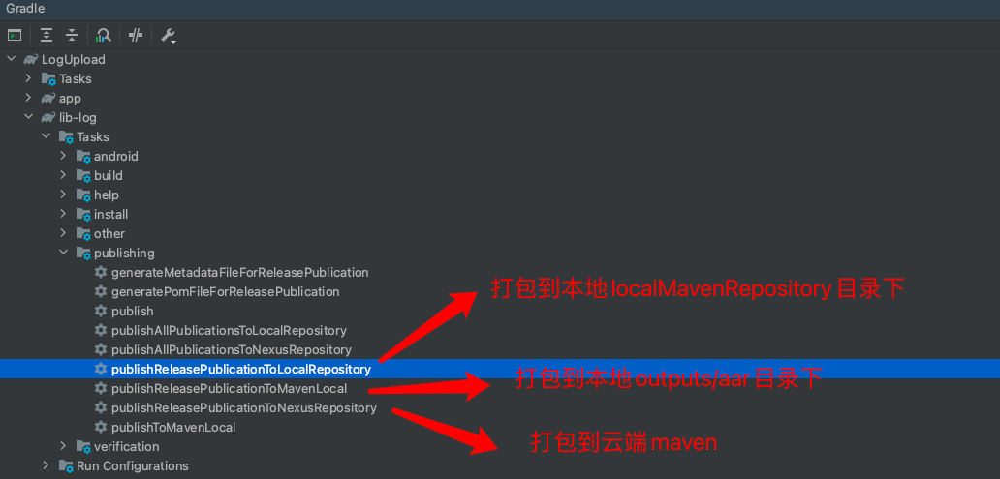
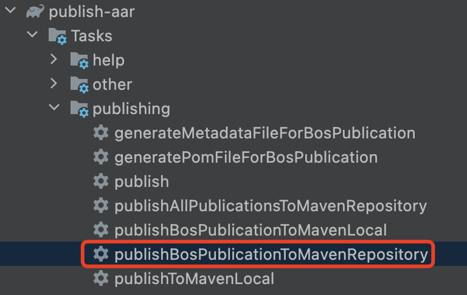

# MavenPublish

[TOC]

## 一. 配置Maven Auth

1. 发布脚本需要在`gradle.properties`中配置以下参数

```properties
RELEASE_URL=******
SNAPSHOT_URL=******
PULISH_NAME=******              #账号
PULISH_PASSWORD=******          #密码
GROUP_ID=com.test.library       #aar依赖配置
ARTIFACT_ID=mlog                #aar依赖配置
VERSION=1.0.0                   #发布RELEASE版本    
VERSION=1.0.0-SNAPSHOT          #发布SNAPSHOT版本
```

2. 上面的配置依赖代码如下

```gradle
implementation 'com.test.library:mlog:1.0.0'
//or最新RELEASE版本
implementation 'com.test.library:mlog:latest.release'
```


## 二. 提交到Nexus


### 1. 发布工程到Maven

这里需要根据Gradle版本选择不同的上传脚本~[官方说明](https://docs.gradle.org/current/userguide/upgrading_version_5.html#changes_6.0)


#### 1.1 Maven（Gradle低于6.0版本）

1. 依赖脚本

```groovy
apply from: 'maven.gradle' //脚本复制到工程目录下
//or
apply from: 'https://gitlab.yc345.tv/lipeng/mavenpublish/-/raw/main/gradle/maven.gradle'  //依赖远程脚本
```

2. 上传




#### 1.2 Maven-Publish（Gradle大于等于6.0）

1. 依赖脚本

```groovy
apply from: 'maven_publish.gradle' //脚本复制到工程目录下
//or
apply from: 'https://gitlab.yc345.tv/lipeng/mavenpublish/-/raw/main/gradle/maven_publish.gradle'  //依赖远程脚本
```

2. 上传


### 2. 发布AAR/JAR到Nexus

1. 依赖脚本

    ```groovy
    apply from: 'maven_publish_aar.gradle'
    ```

2. 添加配置

  每个AAR/JAR都需要增加任务，格式如下：

  * `name`：任务名，最终生成的gradle任务名是:`publish${Name}PublicationToMavenRepository`
  * `groupId`: gradle依赖配置
  * `artifactId`: gradle依赖配置
  * `version`: gradle依赖配置
  * `artifact`: AAR/JAR路径

      ```groovy
          publications {
        
          //eg：publishBosPublicationToMavenRepository
          bos(MavenPublication) {
              groupId GROUP_ID
              artifactId 'bos-android-sdk'
              version '1.0.14'
              artifact '../aars/test-sdk-1.0.0.jar'
          }
        
          name(MavenPublication) {
              groupId GROUP_ID
              artifactId 'artifactId'
              version 'version'
              artifact 'aar、jar relative path'
          }
      }
      ```

3. 上传

    


## 三. 扩展/注意事项

### 1. `project`依赖

待发布的`Library`中如果包含`project`依赖，通过gradle远程依赖后不会包含`project`中的代码。

```groovy
dependencies {
    api project(':annotation') //需要使用下面的gradle依赖替换
   //api "com.github.bumptech.glide:gifdecoder:4.14.2"
}
```

### 2. AAR依赖传递

直接通过`AAR-A`依赖的文件中嵌套了其他`AAR-B`，`APP`依赖`AAR-A`后，无法引用`AAR-B`中的代码资源

```groovy
//APP
dependencies {
    api (name: 'AAR-A', ext: 'aar')
}

//AAR-A
dependencies {
    api (name: 'AAR-B', ext: 'aar')
}
```

解决版本：需要添加如下配置
```groovy
dependencyResolutionManagement {
    repositoriesMode.set(RepositoriesMode.FAIL_ON_PROJECT_REPOS)
    repositories {
        flatDir {
            dirs 'libs'
        }
    }
}
```

### 3. Maven发布到Local

`Maven Publish`脚本添加如下配置后，可将`AAR/Library`发布到本地，实现本地依赖，适合组件化

```groovy

//Maven Publish
repositories {
    maven {
        name = 'local'
        url = "$rootDir/localMavenRepository"
    }
}

//Project
buildscript {
    repositories {
        maven {
            url uri("$rootDir/localMavenRepository")
        }
    }
}
```


